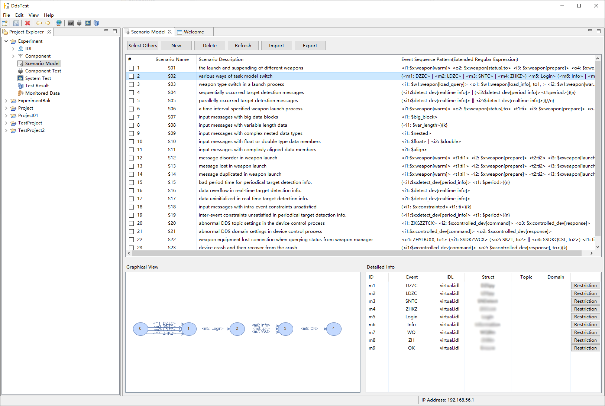

## DDSTest - A Tool for Testing DDS-Based Distributed Systems ##

DDSTest is a tool for automating the testing of publish/subscribe applications implemented on OMG data-distribution service (DDS). With this tool, one can test DDS interfaces without manually writing any test code.

The tool supports generating test datagrams according to .idl interface descriptions of DDS messages. It also supports defining scenario models to do model-based testing. 


### Features ###

* Unit Testing of DDS Interfaces
	*  Automatically generating tests for each single DDS message interface
	*  Automatically executing unit tests     
* Integration Testing of DDS Interfaces
    *  Automatically generating DDS message sequences according to given scenario models
    *  Automatically executing integration tests

### Screenshots ###

 
    
### Example Scenario Models ###

An example scenario model is shown below.

```json
{  
	"name": "device initialization check",
	"event_sequence": "<i1: $x:dev[init ]> (<i2: $x:dev[query]> <o3: $x:dev[status]>){k}",
	"sequence_constraints":{
		"and":{  
			"k_lower_bound": "k >= 1",
			"k_upper_bound": "k <= 5"		
		}
	},
	"data_constraints":{
		"i2": {
			"and":{
				"i1_to_i2_time": "value(i2[current]/time) > value(i1[prev]/time)",
				"i2_to_i2_time": "value(i2[current]/time) > value(i2[prev]/time)"	 
			}
  	}
	},
	"calculators":{
      "sensor": "value(i2[current]/sensor) = select(\"sensor from %s where mode=\'%s\'\", type(i2[current]), value(i1[prev]/mode))"
	},
	"fault_pattern": { 
		"position": "i1[first]/width", 
		"fault": "overflow"
	}
}
```

More tested scenario models can be found in folder `scenario`.

### Specifying the Restrictions on a DDS message ###

DDSTest supports using an extended form of XML Schema to express the data restrictions on a DDS message. The below shows an example of such restrictions.

```XML
<?xml version="1.0" encoding="UTF-8"?>

<xs:schema xmlns:xs="http://www.w3.org/2001/XMLSchema" elementFormDefault="qualified" attributeFormDefault="unqualified">
	
<xs:complexType name="DEVICE1_INIT">
  <xs:sequence>
     <xs:element name="width">
       <xs:simpleType>
         <xs:restriction base="xs:int"> 
            <xs:minInclusive value="100"/>
            <xs:maxInclusive value="200"/>
           </xs:restriction>
       </xs:simpleType>
     </xs:element>
     <xs:element name="length" type="xs:int"/> 
     <xs:element name="area" type="xs:double"/>
     <xs:element name="mode">
	      <xs:simpleType>
          <xs:restriction base="xs:int">
            <xs:enumeration value="0"/>
 	          <xs:enumeration value="1"/>
 	       </xs:restriction>
        </xs:simpleType>
      </xs:element>
	</xs:sequence>

  <constraints>
     <and name="shape_constraint">
	      <constraint> <![CDATA[ value(*/length) > value(*/width) ]]> </constraint>
	      <constraint> <![CDATA[ value(*/length) < 1500 ]]> </constraint>    
     </and>
  </constraints>

  <calculation>
    <calculator>
	      <![CDATA[ value(*/area) = multiply(value(*/width), value(*/length) ) ]]>
    </calculator>  
	</calculation>
</xs:complexType>

</xs:schema>
```
